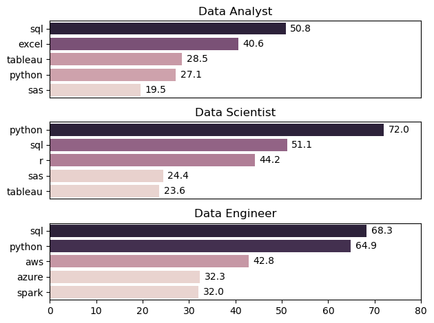
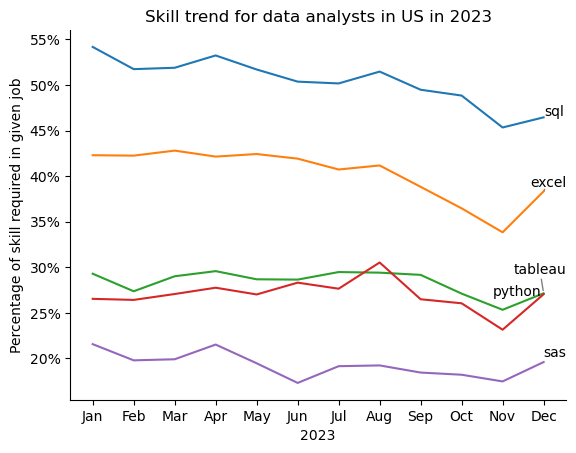

# My data analysis practice
## Dataset used: https://huggingface.co/datasets/lukebarousse/data_jobs
## Project 1. Most demanded skills for most in-demand job roles in the US

I tried discovering the most demanded skills for the top 3 most demanded software engineering roles in the United States. These insights could help users understand what skills they should focus on for maximum chances of getting hired.

View the associated notebook here:  
[top_demanded_skills_p1.ipynb](Project/project1/top_demanded_skills_p1.ipynb)

### Code snippet:

```python
fig,ax = plt.subplots(3,1)
for i, job in enumerate(top_3_jobs):
    df_subset = df_US_true_final[df_US_true_final['job_title_short'] == job]
    sns.barplot(data=df_subset, 
        x='percentage_of_jobs_with_skill', 
        y='job_skills', 
        ax=ax[i], 
        hue='skill_count',
        legend=False
    )
    ax[i].set_title(job)
    ax[i].set_xlabel('')
    ax[i].set_ylabel('')
    ax[i].set_xlim(0,80)
    for n, v in enumerate(df_subset['percentage_of_jobs_with_skill']):
        ax[i].text(v+1, n, v, va='center')
    if(i != len(top_3_jobs)-1):
        ax[i].set_xticks([])

plt.tight_layout()
plt.show()
```
### Results


### Insights

#### 1. Universal Skills
- **SQL**: High demand across all roles (50.8%–68.3%).
- **Python**: Essential for Data Scientist (72%) & Data Engineer (64.9%), moderate for Analyst (27.1%).

#### 2. Role-Specific Trends
- **Data Analyst**: Strong need for **Excel** (40.6%) and **Tableau** (28.5%) — reporting & BI focus.
- **Data Scientist**: Heavy emphasis on **Python**, **R** (44.2%), and statistical tools (**SAS**).
- **Data Engineer**: Strong cloud/tool skills — **AWS** (42.8%), **Azure** (32.3%), **Spark** (32%).

#### 3. Specialization vs Overlap
- Analysts lean on **BI & reporting tools**; less programming-intensive.
- Scientists focus on **programming + statistical analysis**.
- Engineers focus on **data pipelines, cloud, and big data tech**.

#### 4. Strategic Skill Growth
- Learning **SQL + Python** provides strong cross-role opportunities.
- Role-specific boosts:
  - Analyst → Tableau, Excel
  - Scientist → R, SAS
  - Engineer → AWS, Spark, Azure

### Libraries Used

```python
from datasets import load_dataset
import pandas as pd
import seaborn as sns
import matplotlib.pyplot as plt
import ast
```

## Project 2. Trends in skill demands for Data Analysts in the US over the year

After knowing the most, demanded skills across a specific role, it can be crucial to know exactly how much in demand each of the skills was per month, wehn hiring was done, as it can help understand the companies' vision.

View the associated notebook here:  
[skill_trend_over_year.ipynb](Project\project2\skill_trend_over_year.ipynb)

### Code snippet:

```python
from matplotlib.ticker import PercentFormatter
sns.lineplot(df_DA_US_final, dashes=False)
plt.legend().set_visible(False)
sns.despine()
texts = []
for i in range(5):
    texts.append(
        plt.text(11, df_DA_US_final.iloc[-1, i], df_DA_US_final.columns[i])
    )
plt.title('Skill trend for data analysts in US in 2023')
plt.xlabel('2023')
plt.ylabel('Percentage of skill required in given job')
adjust_text(texts, arrowprops=dict(arrowstyle='-', color='gray'))
ax=plt.gca()
ax.yaxis.set_major_formatter(PercentFormatter(decimals=0))
plt.show()
```
### Results


### Insights

#### 1. SQL is critical
- consistently the top requirement for data analysts in the US.

#### 2. Excel remains core 
- stable for most of the year, but saw a late-year dip and rebound.

#### 3. Visualization skills (Tableau) 
- moderately valued, steady demand with small peaks.

#### 4. Python demand is steady
- essential but slightly less prioritized than SQL/Excel.

#### 5. SAS demand is low
- niche usage, possibly legacy system support.

#### 6. Data analyst roles still heavily rely on traditional data tools (SQL, Excel) over newer programming-centric tools.

### Libraries Used

```python
from datasets import load_dataset
import pandas as pd
import seaborn as sns
import matplotlib.pyplot as plt
import ast
from adjustText import adjust_text
```